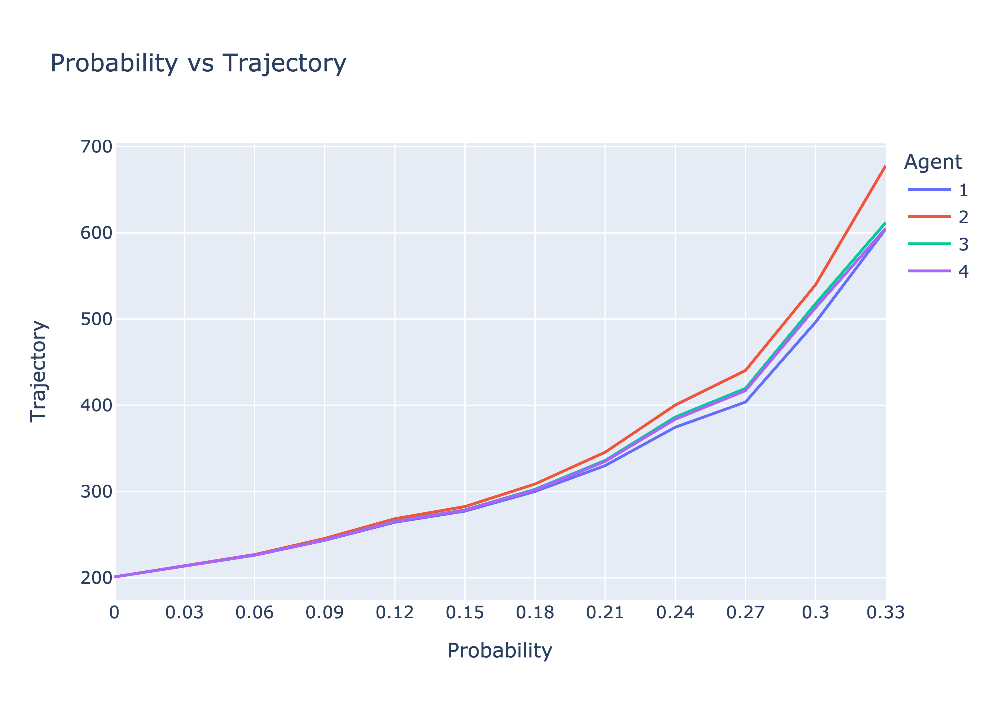
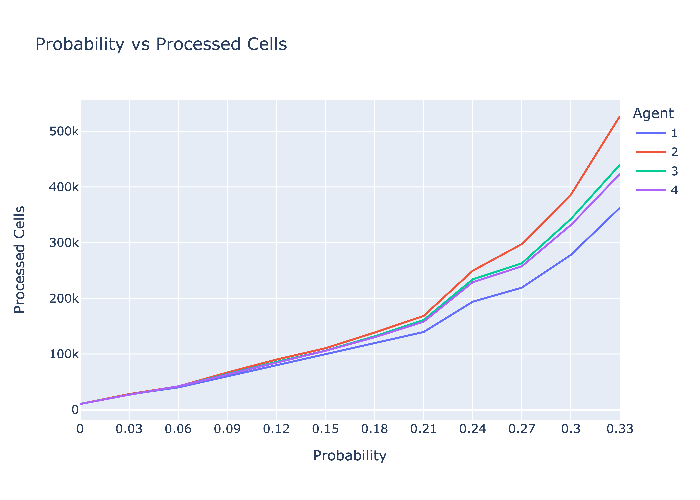
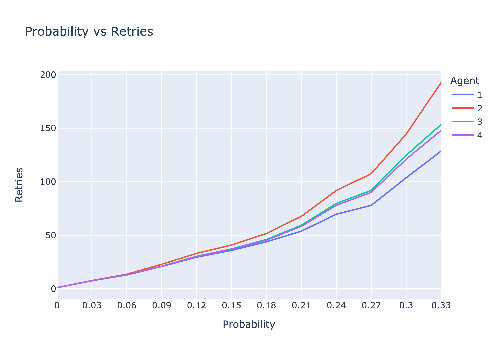
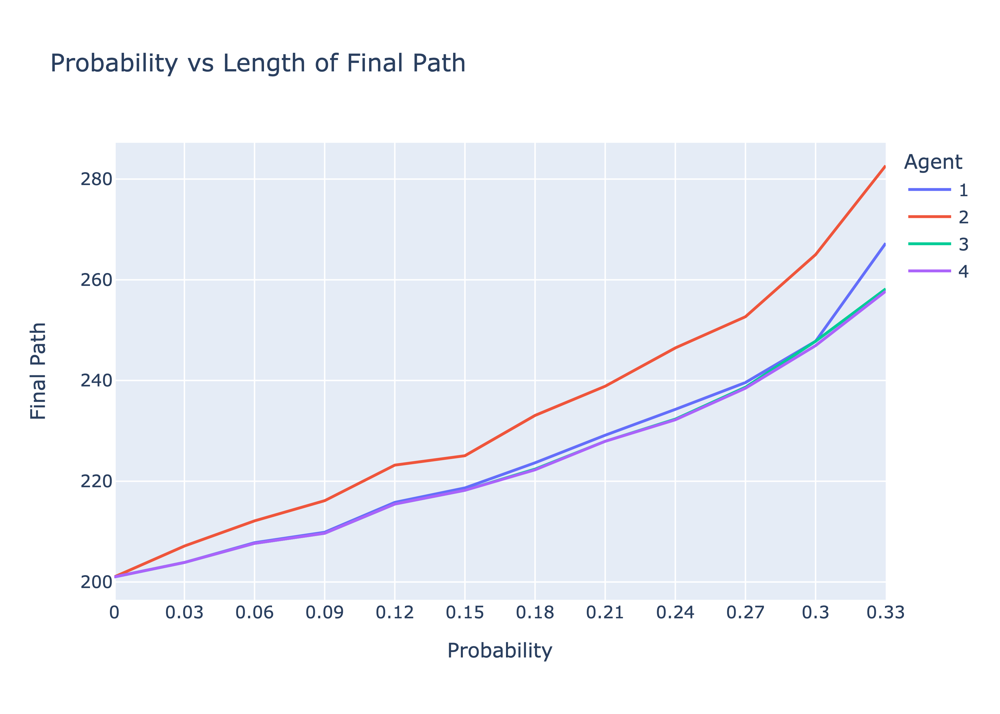

# Partial Sensing
### Advith Chegu (ac1771) & Naveenan Yogeswaran (nry7)
### Both group members contributed equally to the code, data collection, and report.

## How is Agent 3 implemented?
For Agent 3, we use the same planning step as in Agent 1 and 2, but we modify the execution step to take the partial sensing into account to make inferences.

**Information Representation**

To represent our information, we create a Cell object for each cell in the grid which holds information about the cell. The following information is stored:
- *neighbors*: The number of neighbors the cell has.
- *visited*: Boolean value that represents if we visited the cell while executing a path.
- *confirmed*: Boolean value that represents if we were able to confirm whether the cell is empty or a block, either by visiting or through inference.
- *block_sense*: Number of neighbors we sensed to be blocks.
- *confirm_block*: Number of neighbors we confirmed to be blocks.
- *confirm_empty*: Number of neighbors we confirmed to be empty.
- *hidden*: Number of neighbors that we haven't confirmed yet.

Agent 3 stores a grid of these cells (cell_info) to keep track of their information.
Agent 3 will also update its discovered_grid whenever a cell is confirmed.

**Agent 3 Workflow**

In `execute_path`, we traverse the path given to us by our A*. For each cell in the path, we check if the cell is empty or blocked.

If the cell is empty:
- We first sense our surroundings by calling `sense_neighbors`. We do this by looking at the complete_grid and counting the number of blocks that neighbor the cell. We then store the number of blocks in the corresponding cell object's block_sense value.
- We then update the cell's value on the discovered_grid.

If the cell is blocked:
- We update the cell's value on the discovered_grid.
- We set our to_ret value (value to be returned) to the cell before.

For both cases:
- We set the cell's visited value to True.
- We set the cell's confirmed value to True.
- We call `update_neighbors` on that cell to see if we can make any new inferences with this information.

When calling `update_neighbors`, we first add our cell and our neighbors to a set. We then iterate through the set and pop a cell. We first call `update_cell_info` on that cell so the cell gets up to date info on it's neighbors (which neighbors are hidden, confirmed to be empty, confirmed to be block) using the discovered_grid. If the cell was visited and it sensed it's neighbors, we then call `update_knowledgebase` on this cell to begin making inferences.

When calling `update_knowledgebase`, we look at the cell's information.
- If the cell has no hidden neighbors, leave. Nothing more needs to be inferred here.
- If the cell's block_sense is equal to the cell's confirm_block, then turn all hidden cells to empty and add them to the list of updated cells. This is because we've discovered all our block neighbors and know the rest of the hidden must be empty.
- If the cell's neighbors - block_sense is equal to the cell's confirm_empty, then turn all hidden cells to block and add them to the list of updated cells. This is because we've discovered all our empty neighbors and know the rest of the hidden must be block.

After we're done making inferences on that cell, we return the list of cells we just confirmed.

Back in `update_neighbors`, we add the updated cells and their neighbors to our set for further inferences.

We continue doing this in `update_neighbors` until no more cells are updated. Afterwards, we return to execute_path. We then check if any of the newly updated blocks are in our path. If there are, then we stop executing the path.

## Design of Agent 4

Not only is Agent 4 capable of making the same inferences as Agent 3, but Agent 4 is able to make even more inferences with the same amount of information about its environment.

**What rules / inferences / other methods does Agent 4 perform? How does Agent 4 differ from Agent 3?**

By comparing the neighbors of two separate cells, Agent 4 is able to possibly infer the identity of those neighbors. It does this by modeling the neighbors of the cell as an equation.
Take the following example:

U U 1

0 1 1

0 U U

Block Sense = 3

Assume we want to model the neighbors of cell (1,1) as an equation.
This equation would we (0,0) + (0,1) + (2,1) + (2,2) = 1

The reason we don’t include (0,2) and the other neighbors is because we discovered them already. The reason our right hand side is 1 and not 3 is because we already discovered two neighboring blocks.

We can make more inferences with these equations, than in Agent 3, by taking two cell’s equations and performing systems of equations. In the resulting equation, we observe the equation to make the following inferences:

- If the right side of the equation is equal to 0 and the left side are all positive values, then all values in the left side are equal to 0.
    - Example: (0,0) + (0,1) + (1,0) = 0 means (0,0), (0,1), (1,0) must be 0 in order to satisfy the equation.

- If the right side of the equation is greater than 0 and it is equal to the number of positive values in the left side of the equation, then all positive values in the left side must be blocks and all negative values must be 0.
    - Example: (0,0) + (0,1) + (1,0) - (1,2) - (2,2) = 3 means (0,0), (0,1), (1,0) must be 1, and (1,2) and (2,2) must be 0 in order to satisfy the equation.

We also make sure to observe an individual cell’s equation to see if we can make inferences from that, using the same rules as above. This will replicate the inferences that can be made in Agent 3.

**Can you show that there are situations where Agent 4 can infer things that Agent 3 can't, even if they both have the same knowledge base?**

Take the following example:

1 U 0 U U

0 X U Y 0

U 0 U 1 0

X block sense = 4

Y block sense = 2

The equation for cell X is (0,1) + (1,2) + (2,0) + (2,2) = 3

The equation for cell Y is (0,3) + (0,4) + (1,2) + (2,2) = 1

The resulting equation when subtracting is (0,1) + (2,0) - (0,3) - (0,4) = 2

From our inference rules, we can determine that (0,1) and (2,0) are 1 and (0,3) and (0,4) are 0.

1 1 0 0 0

0 X U Y 0

1 0 U 1 0

Agent 3 on the other hand would not have been able to make these inferences as cell X does not have block_sense = confirm_block nor does it have neighbors - block_sense = confirm_empty. The same can be said for cell Y as well. Thus, Agent 4 was able to make more inferences than Agent 3.

**Does Agent 3 ever get anything that Agent 4 does not?**

Agent 3 won’t ever get anything that Agent 4 will not. This is because the equation representation can also replicate the inferences made by Agent 3 when we make inferences on a single cell’s equation.

For example, we can replicate Agent 3’s inference rule that checks if block_sense = confirm_block.

1 U 1

0 X 1

0 U U

X block sense = 3

The equation for X is (0,1) + (2,1) + (2,2) = 0
From our first new rule of inference, we know that (0,1), (2,1) and (2,2) must be 0 to satisfy the equation. And so we replicated this inference from Agent 3 in Agent 4.

We can also replicate Agent 3’s inference rule that checks if neighbors - block_sense = confirm_empty.

1 U 1

0 X 0

0 0 U

X block sense = 4

The equation for X is (0,1) + (2,1) = 2

From our second new rule of inference, we know that (0,1) and (2,1) must be 1 to satisfy the equation. And so we replicated this inference from Agent 3 in Agent 4.

Because our Agent 4 can make the same inferences as Agent 3, Agent 3 shouldn’t be able to get any more information than what Agent 4 can.

**Does Agent 4 infer "everything that is possible to infer" and if not, why not? Can you construct situations where inference is possible, but Agent 4 doesn't infer anything?**


## How is Agent 4 implemented?
Agent 4 is very similar to Agent 3 in that we must either make inferences to find the blockers or bump into them.

**Information Representation**

To represent our information, we create a Cell object for each cell in the grid which holds information about the cell. The following information is used by agent four:

- *visited*: Indicates whether our agent has physically traversed that cell or not
- *confirmed*: Indicates whether we have been able to make an inference about that cell
- *block_sense*: Number of blocked neighbors. This value is calculated when the given node is visited.
- *equation*: The tuples of coordinates which will be used to create the left hand side of the system of equations
- *right_side*: The number of hidden cells that are blocked. This value is decremented when a hidden neighbor is found to be a block. It is also the right hand side of the system of equations.

Agent 4 stores a grid of these cells (cell_info) to keep track of their information.
Agent 4 will also update its discovered_grid whenever a cell is confirmed.

**Agent 4 Workflow**

Just like Agent 3, in Agent 4 we start off in its `execute_path` function where we are passed the path from an iteration of repeated A* as well as the complete gridworld used for block sensing.

For each cell in the path, we check if the cell is empty or blocked.

If the cell is empty:
- Calculate the number of blocks around the cell by calling `sense_neighbors`. We do this by looking at the complete_grid and counting the number of blocks that neighbor the cell. We then store the number of blocks in the corresponding cell object's block_sense value.
- Update our cell's value in the discovered gridworld
- If the cell was not visited already we add it to the set of visited cells to try to make inferences against every time a cell has been updated.

If the cell is blocked:

- We update the cell's value on the discovered_grid.
- We set our to_ret value (value to be returned) to the cell before.
- We set our bump value to *true* which means that there exists an obstacle in the path

For both cases:

- We set the cell's visited value to True.
- We set the cell's confirmed value to True.
- We call `update_neighbors` on that cell to see if we can make any new inferences with this information.

When calling `update_neighbors` we first create a set of the newly confirmed cells. This set will update with any cells we have made an inference on.

We also create a neighbors list which updates with all of the neighbors of the cells we make inferences on. This is because these are the cells that get updated when another is confirmed so to optimize our code we only update these equations rather than all the equations in the grid.

We traverse through the neighbors list popping one at a time until there have been no new inferences, in which case the neighbors list will be empty. Each time we pop from the list we update the cell's equations in `update_equation` by looking at the unconfirmed neighbors and replacing the old equation with the new equation. We also recalculate the right hand side of the equation by first recalculating the confirmed blocks in the cell's neighbors and subtracting that from block sense.

To make inferences we first confirm that the given cell has been visited, or else the right hand side of the equation will be -1. Next we call `update_knowledgebase` where the following steps take place:
- We first get all of the current cell's neighbors
- Next we try to make an inference using only the cell's current equation. Basically if the terms in the equation's left hand side equals the right hand side we can assume that all the terms in the equation are blocked
- Then we have a double for loop to try to make inferences by subtracting every possible combination of equations. We do subtract by finding the coordinates which are not shared amongst the equation sets for the left side and taking the difference of the unconfirmed blocked nodes on the right.
```python
result = cell1.equation.symmetric_difference(cell2.equation)
right_hand_side = abs(cell1.right_side - cell2.right_side)
```
- When subtracting we set the third element of the coordinate tuple to be negative one if it comes from the equation being subtracted.
- Now we make a few inferences, if the right hand side is zero but there are still coordinates in the equation after we subtracted, then we know that all of those cells are zero, we set them as such
- We can also infer that if the positive coordinates are the same as the number of blocks that all the cells at the positive coordinates must be blocks and the negative ones must be open.
- Once we make those inferences and update the discovered gridworld, we can go back and append those cells and its neighbors to have their equations updated.

## Graphs and Analysis
Agent 1 = The 4-Neighbor Agent

Agent 2 = The Blindfolded Agent

Agent 3 = The Example Inference Agent

Agent 4 = Our Own Inference Agent


When observing the general trend of all the Agents as density increases, we noticed that all Agents had an increase in trajectory as density increases. We expected this because as density increases, the chances of running into a block (obstacle) while executing the path also increases. Whenever we run into a block, we must replan to move around the block which increases our trajectory. An increase in density will also increase our chances of travelling to a deadend which will also increase our trajectory as we backtrack.

When comparing Agents 3 and 4 with Agent 2, we noticed a significant increase in performance. We expected this because Agents 3 and 4 have access to the same information as Agent 2 and more. This means Agents 3 and 4 must be at least as good as Agent 2. However, we also have the ability to sense how many of our neighbors are blocks in Agents 3 and 4 which gives us more information. Using this partial information along with the inferences we make, we can discover more of our discovered grid as we move along. This allows us to plan better paths in Agents 3 and 4 which decreases our trajectory as we will run into less blocks and deadends. We also noticed that as density increases, the improvement increases as well. This is also expected because smaller densities mean smaller chances of running into blocks. More knowledge of the grid becomes more useful as density increases because we can replan better paths when we run into obstacles.

When comparing Agents 3 and 4 with Agent 1, we noticed they don’t perform as well as Agent 1. An explanation for this could be that having less and guaranteed knowledge is better than having more but not guaranteed knowledge. After all, if we can’t make much inferences in Agents 3 and 4, we won’t discover many neighbors compared to Agent 1 which will always discover at most 4 neighbors. Thus, this guaranteed knowledge may help discover the grid better than the partial knowledge, especially early in the process. Agents 3 and 4 may suffer from the fact that a few cells may need to be visited before they can infer more about their neighbors. Agent 1, however, has knowledge of 4 of their neighbors which may help guide Agent 1 to a better path early on in the process, which leads to better paths towards the goal cell.  We also noticed that as density increases, the difference also seems to increase for a while. This can be expected because being able to discover more of the grid early will give Agent 1 an advantage over Agents 3 and 4 for replanning.

When comparing Agents 3 and 4, we noticed a slight and consistent improvement in Agent 4 compared to Agent 3. We expected Agent 4 to be at least as good as Agent 3 because Agent 4 is able to make the same inferences as Agent 3. Thus, by having more inference capabilities, Agent 4 will be able to discover more of the grid than Agent 3. It’s for this reason that we also expected Agent 4 to beat Agent 3 as Agent 4 can infer more and discover more of the grid. As density increases, the difference between the two increases as Agent 4 will discover more of the grid and be able to plan better paths when it encounters an obstacle using it’s knowledge.



Similar to trajectory, when observing the general trend of all the Agents as density increases, we noticed that all Agents had an increase in cells processed as density increases. We expected this because as density increases, the chances of running into a block (obstacle) while executing the path also increases. Whenever we run into a block, we must replan to move around the block. By replanning again, we have to process more cells.

When comparing Agents 3 and 4 with Agent 2, we noticed a significant improvement. As mentioned earlier, Agents 3 and 4 have access to the same info as Agent 2 and more. As a result Agents 3 and 4 will be able to discover more of the grid than Agent 2. This allows Agents 3 and 4 to plan better paths than Agent 2 which decreases the chance of running into a block. By reducing their chances of running into a block compared to Agent 2, they will have to process less cells. We also expected the difference to increase as density increases because an increase in density means a higher chance of running into a block, which gives Agents 3 and 4 an advantage as they can plan better paths than Agent 2 to avoid more blocks.

When comparing Agents 3 and 4 with Agent 1, we noticed that Agent 1 was able to beat Agents 3 and 4. This, again, seems to indicate that getting less and guaranteed information is advantageous over getting more but not guaranteed information. Agent 1 has the advantage of knowing some of its neighbors early in the process which may lead it to a better path early on while Agents 3 and 4 may lead to worser paths while waiting for enough info to infer about their neighbors. Thus, they may encounter blocks more often and have to process more cells when replanning. We expected this difference to increase as density increases because knowing more about the grid early on will be advantageous for Agent 1 when there are more blocks in the grid.

When comparing Agents 3 and 4, we noticed a significant and consistent improvement in Agent 4. Because Agent 4 can make the same inferences and more than Agent 3, Agent 4 is able to discover more of the grid. This gives Agent 4 the advantage to plan paths that allows it to better avoid blocks. By avoiding more blocks, Agent 4 will spend less time planning than Agent 3 and so it will have to process less cells than Agent 3. We can see why the differences increase as density increases because higher densities will increase the chance of running into a block which Agent 4 does better at avoiding compared to Agent 3.


Retries is the number of times A* was repeated to get to the goal node.

Similar to trajectory, when observing the general trend of all the Agents as density increases, we noticed that all Agents had an increase in retries as density increases. We expected this because as density increases, the chances of running into a block (obstacle) while executing the path also increases. And so, we must retry A*.

When comparing Agents 3 and 4 with Agent 2, we noticed a significant improvement. For the same reasons mentioned in trajectory and cells processed, this is expected because Agent 3 and 4 will discover more of the grid than 2 and will thus be able to plan better paths. By planning better paths, we decrease the number of times we must retry our A*.

When comparing Agents 3 and 4 with Agent 1, we again noticed that Agent 1 was able to beat Agents 3 and 4. This confirms our hypothesis from the previous observations that Agent 1 is performing better than Agent 3 and 4 as it encounters less blocks in its path. As mentioned earlier, this may likely be because Agent 1 has access to more info earlier in the process which allows it to travel to better paths from the start compared to Agents 3 and 4.

When comparing Agents 3 and 4, we again noticed a consistent improvement in Agent 4. This confirms our previous observations that Agent 4 is performing better than Agent 3 because it is encountering less blocks. This is only possible because Agent 4 is making more inferences than Agent 3 and is thus able to discover more of the grid. By doing this, Agent 4 is making better paths to avoid obstacles than Agent 3.


Lastly, we observed the shortest path to the goal in the fully discovered grid.
We again notice that all Agents increase their trajectory as the density increases. This is expected because higher densities will cause us to encounter more blocks and deadends. This means we have to replan and either move around or backtrack which increases the trajectory.

When comparing Agents 3 and 4 to Agent 2, we noticed a significant improvement. This is because Agents 3 and 4 have discovered more of the grid than Agent 2 due to their ability to sense and make inferences about their neighbors, which discovers more of the grid if they are able to make inferences. As a result, we discovered more of the grid which allowed us to discover a shorter path to the goal in the discovered grid of Agents 3 and 4.

When comparing Agents 3 and 4 to Agent 1, we noticed something interesting. While Agent 1 was able to beat Agents 3 and 4 in every other performance test, Agent 1 was consistently defeated by both 3 and 4 in this test. This seems to confirm our earlier hypothesis that Agent 1 may have an advantage of having access to more information in the beginning while Agents 3 and 4 are still waiting for enough info to make inferences. This is seen as Agent 1 can’t find a shorter path through it’s discovered grid, meaning that it discovered less of the grid than Agents 3 and 4. Thus, the only way Agent 1 can still beat Agents 3 and 4 in the other tests is by knowing more info in the beginning and going along a better path, while Agents 3 and 4 went to more worse paths while waiting for enough info to make inferences.

When comparing Agents 3 and 4 together, we notice a slight and consistent improvement in Agent 4. Agent 4 should perform just as good as Agent 3 because Agent 4 will have discovered more of the grid than Agent 3. The reason for the slight improvement could be that the new inferences made were not significant enough to consistently be able to discover an entirely new and shorter path in the discovered grid.


## Computational Optimizations
In Agent 3 and 4, we take multiple steps to minimize computations in order to ensure our Agents run as efficiently as they can.

The first step we take to minimize computations is how we traverse our grid and update our cell_info. We realized that when updating a cell, not every cell will be affected by this change and therefore will not make any new inferences. The only cells we need to update and can possibly make inferences on are the neighboring cells and the current cell. And so, rather than updating every cell in the grid and checking for new inferences on them, we add these neighboring cells and the current cell to a set and we traverse only through the cells in the set. 

Whenever we infer the identity of a cell, we make sure to add this cell and its neighbors to our set. Whenever we pop the cell from the set, we update it’s info on neighbors to ensure it’s up to date and we make inferences if we can. We repeat this until the set is empty, which means there are no more inferences to be made. Thus, we significantly improve our computational overhead by ignoring cells that aren’t affected by the changes.

The next step we take to minimize computations is to ignore non-sensed cells when making inferences on them. We can ignore these cells because they haven’t sensed how many of their neighbors are blocks. Without access to this information, we can’t make any inferences on them. As a result we choose to ignore these cells when making inferences in order to avoid wasting any computations on these cells.
